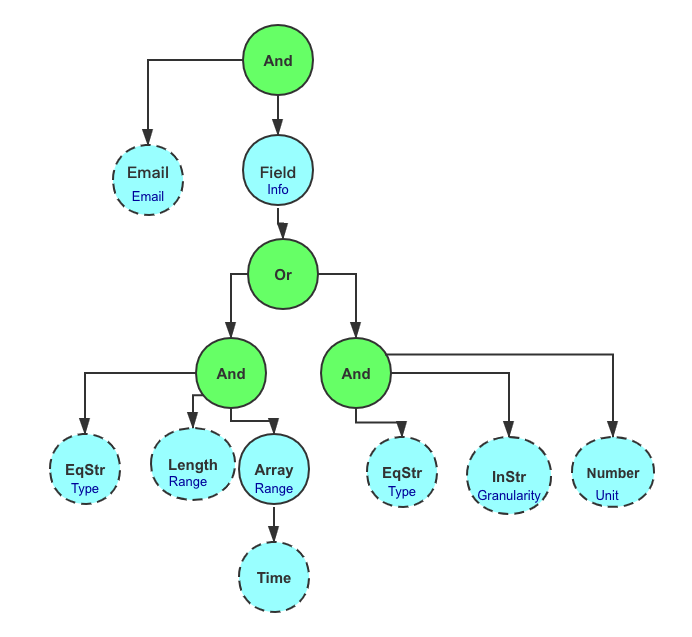
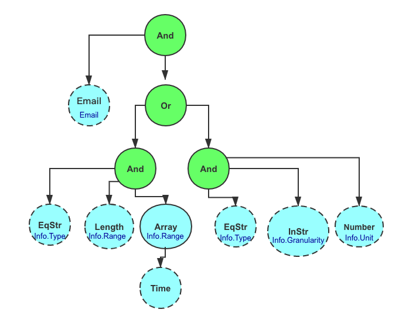

# Checker
[](https://goreportcard.com/report/github.com/liangyaopei/checker)
[](http://godoc.org/github.com/liangyaopei/checker)
[](https://pkg.go.dev/github.com/liangyaopei/checker)
[](https://travis-ci.com/liangyaopei/checker)

[](https://coveralls.io/github/liangyaopei/checker?branch=master)

[中文版本](README_zh.md)

`Checker` is a parameter validation package, can be use in struct/non-struct validation, including cross field validation in struct, elements validation in Slice/Array/Map, and provides customized validation rule.

## Requirements

Go 1.13 or above.

## Installation

```
go get -u github.com/liangyaopei/checker
```


## Usage

When use `Add` to add rule，`fieldExpr` has three situations：
- `fieldExpr` is empty，validate the value directly.
- `fieldExpr` is single field，fetch value in struct, then validate.
- `fieldExpr` is string separated by `.`, fetch value in struct according hierarchy of struct, then validate.

When fetching value by `fieldExpr`, if the field is pointer, it will fetch the underlying value of pointer
to validate; if the field is nil pointer, it failed validation rule. 

For special use of validating nil pointer, `Nil` rule can be used.

example from `checker_test.go`
```go
// Item.Email is the format of email address
type Item struct {
	Info  typeInfo
	Email string
}

type typeStr string
// Item.Info.Type = "range",typeInfo.Type 's length is 2，elements with format of "2006-01-02"
// Item.Info.Type = "last",typeInfo.Type 'is length is 1，elements is positive integer，Granularity is one of day/week/month
type typeInfo struct {
	Type        typeStr
	Range       []string
	Unit        string
	Granularity string
}


// rules are as follow
rule := And(
		Email("Email"),
		Field("Info",
			Or(
				And(
					EqStr("Type", "range"),
					Length("Range", 2, 2),
					Array("Range", isDatetime("", "2006-01-02")),
				),
				And(
					EqStr("Type", "last"),
					InStr("Granularity", "day", "week", "month"),
					Number("Unit"),
				),
			),
		),
	)
itemChecker := NewChecker()
// validate parameter
itemChecker.Add(rule, "wrong item")
```
`rule` variable in above code constructs a rule tree.


To Note that, different rule tree can produce same validation rule, above `rule` can be rewritten as
```go
rule := And(
		Email("Email"),
		Or(
			And(
				EqStr("Info.Type", "range"),
				Length("Info.Range", 2, 2),
				Array("Info.Range", Time("", "2006-01-02")),
			),
			And(
				EqStr("Info.Type", "last"),
				InStr("Info.Granularity", "day", "week", "month"),
				Number("Info.Unit"),
			),
		),
	)
```


Although rule trees are different, `fieldExpr` of leaf nodes in trees are same, which can be used as cache,
and the validation logic is same.


## Rule
`Rule` is an interface, it has many implementations. Its implementations can be categorized into
two kinds: composite rule and singleton rule.

### Composite Rule

Composite Rule contains other rules.

| Name                                                       | Usage                                                 |
| ---------------------------------------------------------- | ----------------------------------------------------- |
| `Field(fieldExpr string, rule Rule) Rule`                  | Applies `rule` to validate `fieldExpr`                |
| `And(rules ...Rule) Rule`                                  | It needs all rules pass                               |
| `Or(rules ...Rule) Rule`                                   | It needs any rule passed                              |
| `Not(innerRule Rule) Rule`                                 | opposite the rule                                     |
| `Array(fieldExpr string, innerRule Rule) Rule`             | Applies rule to elements in array                     |
| `Map(fieldExpr string, keyRule Rule, valueRule Rule) Rule` | Applies keyRule and valueRule to key and value in map |


### Singleton Rule

Singleton Rule can  be categorized into comparison rule, enum rule and format rule.

#### Comparison Rule


Comparison Rule can be categorized into single field comparison rule and multi-field comparison rule


single field comparison rule includes:

| Name                                              |
| ------------------------------------------------- |
| `EqInt(filedExpr string, equivalent int) Rule`    |
| `NeInt(filedExpr string, inequivalent int) Rule`  |
| `RangeInt(filedExpr string, ge int, le int) Rule` |


It also has the implementation of `uint`, `string`，`float`，`time.Time` , `Comparable`.


multi-field comparison rule includes 

| Name                                                         |
| ------------------------------------------------------------ |
| `CrossComparable(fieldExprLeft string, fieldExprRight string, op operand) Rule` |


`fieldExprLeft`，`fieldExprRight` is to located the field involving comparsion, `op` is the operand.

`CrossComparable` supports `int`\`uint`\`float`\`string`\`time.Time`\`Comparable`.

####  Enum Rule

Enum Rule includes

| Name                                              |
| ------------------------------------------------- |
| `InStr(filedExpr string, enum ...string) Rule`    |
| `InInt(filedExpr string, enum ...int) Rule`       |
| `InUint(filedExpr string, enum ...uint) Rule`     |
| `InFloat(filedExpr string, enum ...float64) Rule` |


#### Format Rule

Format Rule includes

| Name                            |
| ------------------------------- |
| `Email(fieldExpr string) Rule`  |
| `Number(fieldExpr string) Rule` |
| `URL(fieldExpr string) Rule`    |
| `Ip(fieldExpr string) Rule`     |

etc.


#### Customized Rule

In addition to above rules, user can pass validation function to `Custome` to achieve purpose of 
implementing customized rule, refer to [example](_example/custom/main.go)


## Checker


`Checekr` is an interface

- `Add(rule Rule, prompt string)`. Add rule and error prompt of failing the rule.
- `Check(param interface{}) (bool, string, string)`. Validate a parameter. It returns if it passes the rule, error prompt and error message to tell which field doesn't pass which rule.

## Error log And Customized Error Prompt

When defining rules, it can define the error prompt when rule failed.[example](_example/prompt/main.go)
```go
rule := checker.And(
		checker.Email("Email").Prompt("Wrong email format") // [1],
		checker.And(
			checker.EqStr("Info.Type", "range"),
			checker.Length("Info.Range", 2, 2).Prompt("Range's length should be 2") // [2],
			checker.Array("Info.Range", checker.Time("", "2006-01-02")).
				Prompt("Range's element should be time format") // [3],
		),
	)

	validator := checker.NewChecker()
	validator.Add(rule, "wrong parameter") // [4]
    isValid, prompt, errMsg := validator.Check(item)
```

When rule fails, checker tries to return the rule's prompt([1]/[2]/[3] in code). If rule doesn't
have its prompt, checker returns the prompt when adding the rule([4] in code).


`errMsg` is error log, is used to locate the filed that fails, refer it to [example](_example/composite/main.go)


## Field Cache
From above graphic representation of rule tree, it can be found that when leaf node
with same field expression, its value can be cached to reduce the cost of reflection.